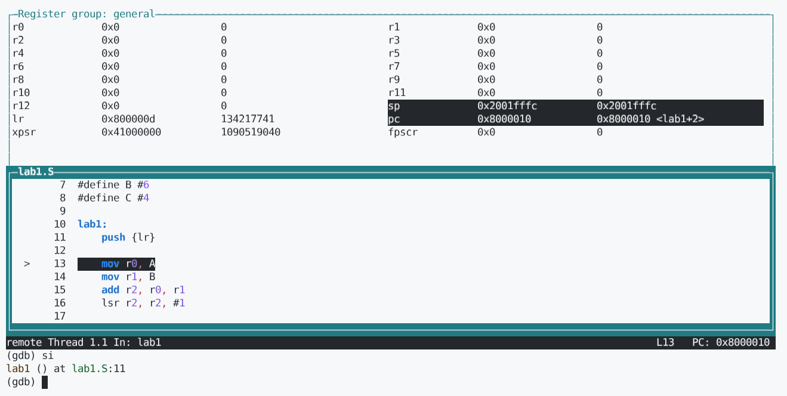
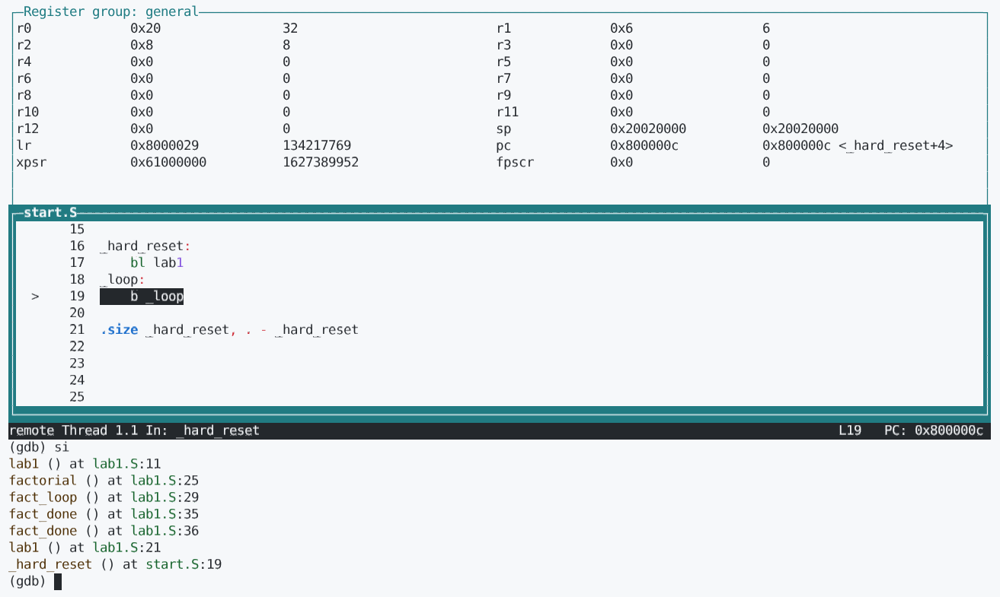

# Лабораторна робота №2

## Відомості

### Тема

ОСНОВНІ ІНСТРУКЦІЇ 32-БІТНОГО ARM ПРОЦЕСОРА ДЛЯ МІКРОКОНТРОЛЕРІВ

### Мета

Навчитися використовувати асемблерні інструкції ядра Cortex-M4, працювати з процедурами і базово зрозуміти архітектуру ядра. Навчитися розуміти синтаксис мови асемблера GAS (GNU Assembly), що є частиною стандартного пакету тулчейну GCC (GNU Compiler Collection) для арм (arm-none-eabi-). Навчитися працювати з GDB відлагоджувачем.

### Варіант 0

```bash
> console.log((3210 % 5))
0
```

(a + b)/2 + c!

## Хід роботи

### Підготовка середовища

#### Dockerfile

```Dockerfile
FROM ubuntu:22.04

RUN apt-get update && apt-get install -y \
    gcc-arm-none-eabi \
    binutils-arm-none-eabi \
    libnewlib-arm-none-eabi \
    gdb-multiarch \
    stlink-tools \
    make \
    wget \
    tar \
    libx11-6 \
    libxext6 \
    libxrender1 \
    libxtst6 \
    libasound2 \
    && rm -rf /var/lib/apt/lists/*

WORKDIR /opt
RUN wget https://github.com/xpack-dev-tools/qemu-arm-xpack/releases/download/v7.2.0-1/xpack-qemu-arm-7.2.0-1-linux-x64.tar.gz \
    && tar xvf xpack-qemu-arm-7.2.0-1-linux-x64.tar.gz \
    && rm xpack-qemu-arm-7.2.0-1-linux-x64.tar.gz

ENV PATH="$PATH:/opt/xpack-qemu-arm-7.2.0-1/bin"

WORKDIR /app
```

#### Будуємо образ

```bash
maxim@x540ubr:~$ docker build -t stm32-kradozhon-io32 .
...
maxim@x540ubr:~$ docker run -it -v $(pwd):/app stm32-kradozhon-io32
```

### Збірка проєкту

#### start.S

```S
.syntax unified
.cpu cortex-m4
.thumb

.global vtable
.type vtable, %object

vtable:
    .word _stack_start
    .word _hard_reset + 1
.size vtable, . - vtable

.global _hard_reset
.type _hard_reset, %function

_hard_reset:
    bl lab1
_loop:
    b _loop

.size _hard_reset, . - _hard_reset
```

#### lab1.S

```S
.global lab1
.syntax unified
.cpu cortex-m4
.thumb

#define A #10
#define B #6
#define C #4

lab1:
    push {lr}

    mov r0, A
    mov r1, B
    add r2, r0, r1
    lsr r2, r2, #1


    mov r0, C
    bl factorial
    add r0, r0, r2
    pop {pc}

factorial:
    push {r1}
    mov r1, r0
    mov r0, #1
fact_loop:
    cmp r1, #1
    ble fact_done
    mul r0, r0, r1
    sub r1, r1, #1
    b fact_loop
fact_done:
    pop {r1}
    bx lr
```

#### lscript.ld

```ld
MEMORY
{
    FLASH (rx) : ORIGIN = 0x08000000, LENGTH = 1024K
    RAM (rwx)  : ORIGIN = 0x20000000, LENGTH = 128K
}

/* Визначаємо початкову адресу стеку (кінець RAM) */
_stack_start = ORIGIN(RAM) + LENGTH(RAM);

SECTIONS
{
    .text :
    {
        KEEP(*(.vtable)) /* Таблиця векторів має бути першою */
        *(.text)
        *(.text*)
    } > FLASH

    .data :
    {
        *(.data)
    } > RAM AT > FLASH

    .bss :
    {
        *(.bss)
    } > RAM
}
```

#### Makefile

```Makefile
CC = arm-none-eabi-gcc
LD = arm-none-eabi-ld

CFLAGS = -mthumb -mcpu=cortex-m4 -g -x assembler-with-cpp
LDFLAGS = -T lscript.ld

all: firmware.elf

firmware.elf: start.o lab1.o
	$(LD) $(LDFLAGS) start.o lab1.o -o firmware.elf

%.o: %.S
	$(CC) $(CFLAGS) -c $< -o $@

clean:
	rm -f *.o *.elf

qemu: firmware.elf
	qemu-system-arm -M netduinoplus2 -cpu cortex-m4 -nographic -kernel firmware.elf -S -gdb tcp::1234
```

#### Процес

```bash
root@05193ba2998e:/app# make
arm-none-eabi-gcc -mthumb -mcpu=cortex-m4 -g -x assembler-with-cpp -c start.S -o start.o
arm-none-eabi-gcc -mthumb -mcpu=cortex-m4 -g -x assembler-with-cpp -c lab1.S -o lab1.o
arm-none-eabi-ld -T lscript.ld start.o lab1.o -o firmware.elf
root@05193ba2998e:/app# make qemu
qemu-system-arm -M netduinoplus2 -cpu cortex-m4 -nographic -kernel firmware.elf -S -gdb tcp::1234
```

- Інше вікно терміналу

```bash
root@05193ba2998e:/app# gdb-multiarch firmware.elf
GNU gdb (Ubuntu 12.1-0ubuntu1~22.04.2) 12.1
Copyright (C) 2022 Free Software Foundation, Inc.
License GPLv3+: GNU GPL version 3 or later <http://gnu.org/licenses/gpl.html>
This is free software: you are free to change and redistribute it.
There is NO WARRANTY, to the extent permitted by law.
Type "show copying" and "show warranty" for details.
This GDB was configured as "x86_64-linux-gnu".
Type "show configuration" for configuration details.
For bug reporting instructions, please see:
<https://www.gnu.org/software/gdb/bugs/>.
Find the GDB manual and other documentation resources online at:
    <http://www.gnu.org/software/gdb/documentation/>.

For help, type "help".
--Type <RET> for more, q to quit, c to continue without paging--
Type "apropos word" to search for commands related to "word"...
Reading symbols from firmware.elf...
(gdb) target remote :1234
Remote debugging using :1234
_hard_reset () at start.S:17
17          bl lab1
```





## Висновки

У ході виконання лабораторної роботи №2 я опанував синтаксис мови асемблера GAS та навчився використовувати інструкції 32-бітного ядра Cortex-M4 для обчислення складних арифметичних функцій. Я здобув практичні навички роботи з процедурами, використання стеку та реалізації циклічних алгоритмів для обчислення факторіала за допомогою команд `MUL`, `SUB` та умовних переходів. Використання Docker-контейнера забезпечило стабільне середовище з необхідним ARM-тулчейном, а за допомогою відлагоджувача GDB я провів покрокове тестування програми, проаналізував стан регістрів та підтвердив правильність отриманого результату для варіанта №0.

## Github

<https://github.com/TockePie/comp-arch-3/tree/main/lab2>
